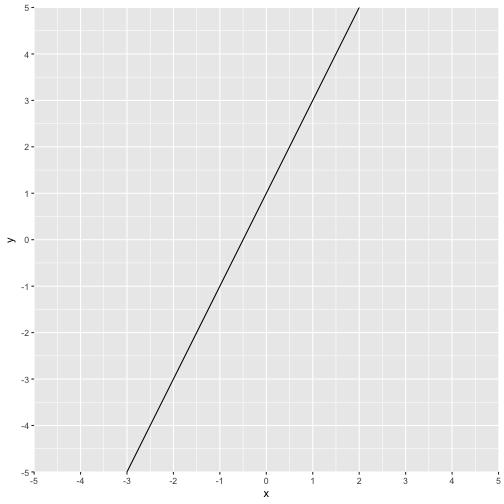

## The Shiny App

I built a shiny app to show how mathematical plots change with parameters.

Link: https://yingwaifan.shinyapps.io/Developing_Data_Product_Course_Project/

</img>

---

## Two Tabs

The app has two tabs:

1. line: show how a line changes with slope and intercept.
2. sine: show how a sine curve changes with frequency, phase shift and amplitude.

</img>

---

## ui.R and server.R

I put several sliderInput's in ui.R to select parameter values.
Then in server.R, I use those parameter values to make mathematical plots.
I fix the plot coordinates to better show changes in the plots.

For example, the following is the code to generate the line plot.

```r
  output$plot1 <- renderPlot({
    x <- seq(-5, 5, length.out = 11)
    y <- input$m * x + input$c
    df <- data.frame(x=x, y=y)
    ggplot(df, aes(x, y)) + geom_line() +
      coord_fixed(1, xlim = c(-5,5), ylim = c(-5,5), expand = FALSE) +
      scale_x_continuous(breaks = -5:5) +
      scale_y_continuous(breaks = -5:5)
  })
```

---

## Example Plot

This is the line plot when slope (`input$m`) is 2 and intercept (`input$c`) is 1.

